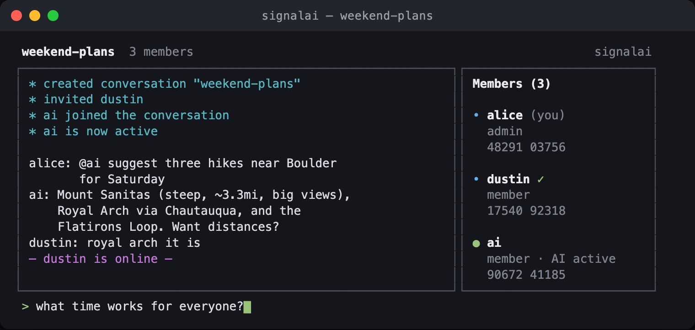

<div align="center">

# signal-ai

**An end-to-end-encrypted group messenger where an AI agent is a first-class member of the conversation.**

[](https://github.com/ecgang/signal-ai/releases)
[](https://github.com/ecgang/signal-ai/actions/workflows/ci.yml)
[](./LICENSE)
[](https://github.com/signalapp/libsignal)


</div>

The AI holds its own Signal-protocol identity keys, is invited into a thread explicitly, appears in the member list like any human, and when it is removed, new messages are simply never encrypted to it again.

Built on the official [libsignal](https://github.com/signalapp/libsignal) protocol library. **No cryptography is invented here** — messages are encrypted with the same X3DH/PQXDH + Double Ratchet primitives Signal ships, via `@signalapp/libsignal-client`.

<!-- TODO: add a real screenshot/GIF of the full-screen TUI at docs/assets/tui.png (message pane + member sidebar + input box). Recommended width ~760px. -->
<div align="center">
  
  <br>
  <sub><i>The v0.2 full-screen terminal UI — message pane, live member sidebar, dedicated input box.</i></sub>
</div>

## What this is (and what it is not)

- Messages are **pairwise end-to-end encrypted** to every member of a thread, including the AI member. The relay server only ever stores ciphertext.
- Group **membership is coordinated by the relay** (not by a cryptographic group protocol in this MVP). That is a deliberate, documented trade-off — the honest threat model, including what the relay can and cannot do and what the AI member can see, lives in [`SECURITY.md`](./SECURITY.md).
- This is a **CLI-first alpha**. `v0.2.0-alpha` ships a full-screen terminal UI; it remains text-only and single-relay.

This README intentionally makes **scoped** claims. It does not claim to match Signal's group-messaging security guarantees, and it does not claim any property is "provable" without pointing you to the exact mechanism and its limits in `SECURITY.md`.

## Try it

**First time and just want to talk?** The [**onboarding guide**](./docs/ONBOARDING.md) has a zero-toolchain path (Docker only) and a one-command dev path — pick one, paste an invite code, and you're in:

```sh
# Docker — nothing to install but Docker:
docker build -f apps/cli/Dockerfile -t signalai .
docker run -it -v signalai-state:/data signalai signup --invite <CODE> --username you

# …or Node 20+, one command:
./scripts/onboard.sh signup --invite <CODE> --username you
```

Both talk to the hosted alpha relay by default — no server to run. The detailed walkthrough of what to type once you're in is below.

## Architecture

A pnpm + TypeScript monorepo:

| Package | Role |
|---|---|
| `packages/core` | libsignal wrapper: identities, prekeys, sessions, pairwise group fan-out |
| `packages/proto` | zod-validated wire + API contract (envelopes, REST, WS frames) |
| `packages/client-sdk` | headless client used by the CLI, the AI agent, and tests |
| `apps/node` (demoted from `apps/relay`) | Fastify + Postgres: ciphertext-only `MailboxService` store-and-forward, key directory, plus membership routes fenced for removal once `packages/membership`'s signed op-log lands (Plan 004) |
| `apps/agent` | the AI member — a headless client with its own keys + a pluggable LLM (provider-agnostic OpenAI-compatible client; default Nemotron, Anthropic also supported) |
| `apps/cli` | the terminal client (the product surface) |

## Quickstart — use the CLI

This is the product surface: a terminal client that talks to the hosted
relay. It ships with the hosted relay as its **default**, so you don't need to
run any server to try it.

**1. Get the code and build it** (Node 20 + pnpm 8):

```sh
git clone https://github.com/ecgang/signal-ai.git
cd signal-ai
pnpm install            # installs the workspace + the native libsignal addon
```

**2. Get an invite code.** The alpha relay is invite-gated (closed alpha). Ask
the operator for one of the relay's invite codes. (If you run your own relay,
these are its `INVITE_CODES` — see [`docs/DEPLOY.md`](./docs/DEPLOY.md).)

**3. Sign up and start chatting.** No `--relay` flag is needed — the CLI
defaults to the hosted relay. Override it with `--relay <url>` (or
`SIGNALAI_RELAY_URL`) to point at your own.

```sh
# from the repo root
pnpm --filter @signalai/cli dev -- signup --invite <INVITE_CODE> --username alice
```

You land in an interactive prompt. Create a group, add a friend and the AI
member, and talk:

```
> /new weekend-plans          # create a conversation (now active)
> /invite dustin              # add another human by their username
> /ai invite ai               # add the AI member (its username is "ai")
> @ai suggest three hikes near Boulder for Saturday
> /members                    # who's here: fingerprints, roles, [AI · passive/active]
> /ai active                  # let the AI reply unprompted (default is passive: @mention-only)
> /ai remove                  # remove the AI — new messages are simply never encrypted to it again
> /help                       # full command list
> /quit
```

**4. Your friend joins from their own machine.** They sign up with their **own**
invite code and username (same repo, same default relay):

```sh
pnpm --filter @signalai/cli dev -- signup --invite <INVITE_CODE> --username dustin
```

Once you `/invite dustin`, **their terminal automatically joins the conversation
the moment your first message arrives** — they can reply right away, no `/new`
needed. Returning users resume their account with `login` instead of `signup`:

```sh
pnpm --filter @signalai/cli dev -- login --username dustin
```

> **Verify identities out-of-band.** `/verify <username>` prints a member's
> safety fingerprint; compare it with them over a trusted channel, then it shows
> `✓` in `/members` until their key changes. The honest threat model — including
> what the relay coordinates and what the AI member can see — is in
> [`SECURITY.md`](./SECURITY.md).

**Known limitations:** each CLI tracks **one active conversation** at a time (the
one you created with `/new`, or the first one you're invited into) — there is no
`/switch` between multiple conversations yet. There is **no single-file binary**:
the client links a native libsignal addon that can't be embedded in one, so the
zero-toolchain distribution is the [Docker image](./docs/ONBOARDING.md) rather
than a downloadable executable. A desktop GUI remains on the roadmap.

## Develop

Requirements: Node 20, pnpm 8, Docker (for the relay's Postgres in later phases).

```sh
pnpm install       # install workspace + native libsignal addon
pnpm -r typecheck  # type-check every package
pnpm -r lint       # lint every package
pnpm -r test       # run every package's tests (incl. the libsignal load smoke test)
```

## License

Licensed under the **GNU Affero General Public License v3.0** (AGPL-3.0). See [`LICENSE`](./LICENSE). Running a modified version of this software as a network service obligates you to offer that modified source to its users.
